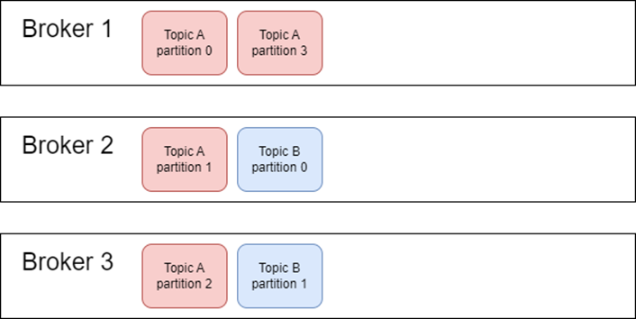
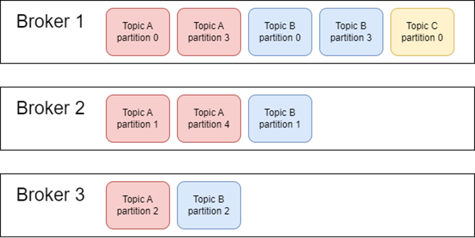
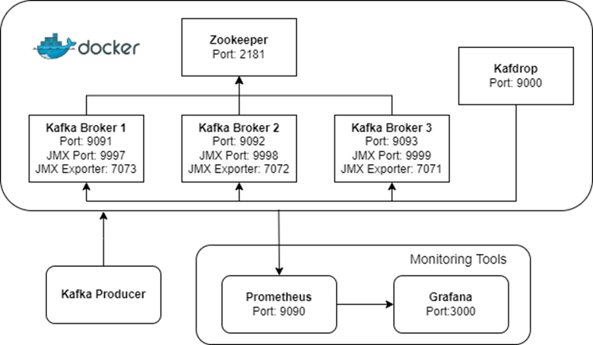

# Biased Partition Rebalancer

Apache Kafka의 biased partition assigning 문제의 해결방안을 구현하여 제시한다.

## Biased Partition Assigning Problem
Kafka Cluster는 Topic을 생성하면서 Partition의 개수를 지정할 수 있다.

생성된 Partition들은 라운드 로빈(Round-Robin)의 방식으로 Kafka Cluster를 구성하는 Broker들에게 적절히 분배된다.

```scala
// kafka/core/src/main/scala/kafka/zk/AdminZkClient.scala
/**
* Creates the topic with given configuration
*
* @param topic             topic name to create
* @param partitions        Number of partitions to be set
* @param replicationFactor Replication factor
* @param topicConfig       topic configs
* @param rackAwareMode     rack aware mode for replica assignment
* @param usesTopicId       Boolean indicating whether the topic ID will be created
*/
def createTopic(topic: String,
              partitions: Int,
              replicationFactor: Int,
              topicConfig: Properties = new Properties,
              rackAwareMode: RackAwareMode = RackAwareMode.Enforced,
              usesTopicId: Boolean = false): Unit = {
val brokerMetadatas = getBrokerMetadatas(rackAwareMode).asJava
val replicaAssignment = CoreUtils.replicaToBrokerAssignmentAsScala(AdminUtils.assignReplicasToBrokers(brokerMetadatas, partitions, replicationFactor))
createTopicWithAssignment(topic, topicConfig, replicaAssignment, usesTopicId = usesTopicId)
}
```

Zookeeper로 관리되는 Kafka Cluster는 Topic을 생성할 때, AdminZkClient의 createTopic 메서드를 호출한다.

해당 메서드 안에서 AdminUtils.assignReplicasToBrokers 메서드를 호출하는데,

해당 메서드에 Partition 분배에 관한 로직이 들어있다.

```java
// kafka/server-common/src/main/java/org/apache/kafka/admin/AdminUtils.java
public static Map<Integer, List<Integer>> assignReplicasToBrokers(Collection<BrokerMetadata> brokerMetadatas,
                                                                  int nPartitions,
                                                                  int replicationFactor,
                                                                  int fixedStartIndex,
                                                                  int startPartitionId) {
    if (nPartitions <= 0)
        throw new InvalidPartitionsException("Number of partitions must be larger than 0.");
    if (replicationFactor <= 0)
        throw new InvalidReplicationFactorException("Replication factor must be larger than 0.");
    if (replicationFactor > brokerMetadatas.size())
        throw new InvalidReplicationFactorException("Replication factor: " + replicationFactor + " larger than available brokers: " + brokerMetadatas.size() + ".");
    if (brokerMetadatas.stream().noneMatch(b -> b.rack.isPresent()))
        return assignReplicasToBrokersRackUnaware(nPartitions, replicationFactor, brokerMetadatas.stream().map(b -> b.id).collect(Collectors.toList()), fixedStartIndex,
            startPartitionId);
    else {
        if (brokerMetadatas.stream().anyMatch(b -> !b.rack.isPresent()))
            throw new AdminOperationException("Not all brokers have rack information for replica rack aware assignment.");
        return assignReplicasToBrokersRackAware(nPartitions, replicationFactor, brokerMetadatas, fixedStartIndex,
            startPartitionId);
    }
}

private static Map<Integer, List<Integer>> assignReplicasToBrokersRackUnaware(int nPartitions,
                                                                              int replicationFactor,
                                                                              List<Integer> brokerList,
                                                                              int fixedStartIndex,
                                                                              int startPartitionId) {
    Map<Integer, List<Integer>> ret = new HashMap<>();
    int startIndex = fixedStartIndex >= 0 ? fixedStartIndex : RAND.nextInt(brokerList.size());
    int currentPartitionId = Math.max(0, startPartitionId);
    int nextReplicaShift = fixedStartIndex >= 0 ? fixedStartIndex : RAND.nextInt(brokerList.size());
    for (int i = 0; i < nPartitions; i++) {
        if (currentPartitionId > 0 && (currentPartitionId % brokerList.size() == 0))
            nextReplicaShift += 1;
        int firstReplicaIndex = (currentPartitionId + startIndex) % brokerList.size();
        List<Integer> replicaBuffer = new ArrayList<>();
        replicaBuffer.add(brokerList.get(firstReplicaIndex));
        for (int j = 0; j < replicationFactor - 1; j++)
            replicaBuffer.add(brokerList.get(replicaIndex(firstReplicaIndex, nextReplicaShift, j, brokerList.size())));
        ret.put(currentPartitionId, replicaBuffer);
        currentPartitionId += 1;
    }
    return ret;
}
```
코드에 등장하는 주요 변수들은 다음과 같다.

- brokerList: Kafka Cluster를 구성하는 Broker의 Metadata를 담은 리스트
- startIndex: 각 Partition 별 첫번째 replication을 얻기 위해 사용하는 index(랜덤)
- currentPartitionId: 설정할 Partition 번호(0부터 시작)
- nextReplicaIndex: 각 Partition의 Replication을 저장할 배열

Topic을 생성할 때 지정한 Partition의 개수만큼 반복문을 돌며,

firstReplicaIndex 변수에 할당할 Broker 번호를 저장한다.

firstReplicaIndex는 ```(currentPartitionId + startIndex) % brokerList.size()``` 로 계산된다.

startIndex는 랜덤으로 값이 지정되며, currentPartitionId는 0부터 시작하여 반복문 내부에서 값이 1씩 증가한다.

해당 부분이 라운드 로빈 방식으로 Broker에 할당되는 부분인데,

위의 로직에 따르면 Topic의 Partition의 개수가 Broker의 개수로 나누어 떨어지지 않으면

당연히도 균등한 분배가 불가능하다.



Topic A가 4개의 Partition을 가지고, Topic B가 2개의 Partition을 가진다고 하자.

만약 Partition의 개수가 각 Broker마다 동일하게 할당된 경우에도 할당된 Topic의 종류가 다르기에 불균형이 발생한다.

만약 Topic A의 처리량이 Topic B보다 유의미하게 높다고 가정하면,

Broker 1은 Broker 2와 Broker 3에 비해 더 많은 부하를 가지게 된다.



Topic A가 5개의 Partition을 가지고, Topic B가 4개의 Partition을, Topic C가 1개의 Partition을 가진다고 하자.

Partition 분배 로직에 따르면, startIndex가 랜덤으로 설정되는데

이때 startIndex가 모두 Broker 1을 가리키는 경우, 심지어 위와 같은 상황도 충분히 발생할 수 있다.

추가적으로, Kafka Cluster에 새로운 Broker가 추가되거나 서비스가 중단된 Broker가 존재하는 상황에도

Partition 분배 상황에 따라 문제가 발생할 수 있다.

이처럼 Partition이 누적된다면 Broker 1의 부하가 높아지고 Broker 간의 부하 불균형이 심화된다.

이러한 문제가 발생하는 원인은 Partition을 분배할 때,

각 Broker의 Disk 용량 혹은 Topic의 데이터 처리량 등을 고려하지 않고

랜덤한 위치에서 라운드 로빈 방식을 적용했기 때문이다.

## Problem Reproduction
로컬 환경에서 문제 상황을 재현하기 위해 Docker Compose를 이용하여 Kafka Cluster 환경을 구성하였다.

Zookeeper와 Kafdrop, 그리고 Kafka Broker 3대를 각각 Docker Container로 실행하여 하나의 서비스로 처리한다.



topic-A와 topic-B는 각각 30개의 Partition을 가지며, replication-factor가 1로 설정되어 있다.

각 Broker는 20개의 Partition이 할당되어 있지만, 각 Topic 별로 개수가 동일하진 않다.

다음과 같은 Partition 개수가 할당되어 있다고 하자.

| Broker   |Topic-A|Topic-B|
|----------|----|----|
| Broker 1 |15|5|
|Broker 2|7|13|
|Broker 3|8|12|

```java
// producer 생성
KafkaProducer<String, String> producer = new KafkaProducer<>(configs);

// message 전달
for (int i = 0; i < 100000000; i++) {
String v = "log-id:" + i + " " + LocalDateTime.now();
    producer.send(new ProducerRecord<>(TOPIC_A, v));
}

for (int i = 0; i < 10000; i++) {
String v = String.valueOf(i);
    producer.send(new ProducerRecord<>(TOPIC_B, v));
}

// 종료
producer.flush();
```

위의 Producer Application은 topic-A에 topic-B보다 10,000배 많은 Message를 전송했고,

Message 내용에서도 차이가 있어 초당 전송된 바이트 수는 약 3배 만큼의 차이가 있었다.

Partition이 편향된 상태에서 Broker가 처리하는 데이터량을 비교해보면

topic-A를 가장 많이 할당 받은 Broker 1에 141K개의 Message가 5.80MB의 속도로 전송되었고,

topic-A를 가장 적게 할당 받은 Broker 2에 59.5K 개의 Message가 2.48MB/s의 속도로 전송되었다.

데이터 처리량의 차이가 존재하여 부하에 불균형이 발생한 것을 확인할 수 있다.

이 경우 topic-A를 많이 할당 받은 Broker 1의 부하가 과도하게 증가하여 시스템 성능이 저하되고,

topic-B를 많이 할당 받은 Broker 2의 자원이 충분히 활용되지 않아 비효율적인 시스템 운영을 야기한다.